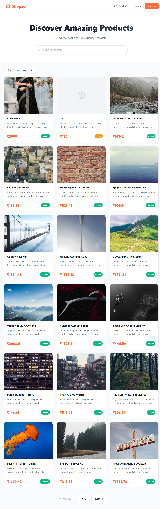
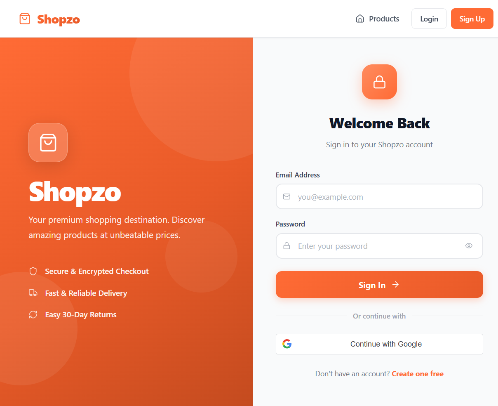
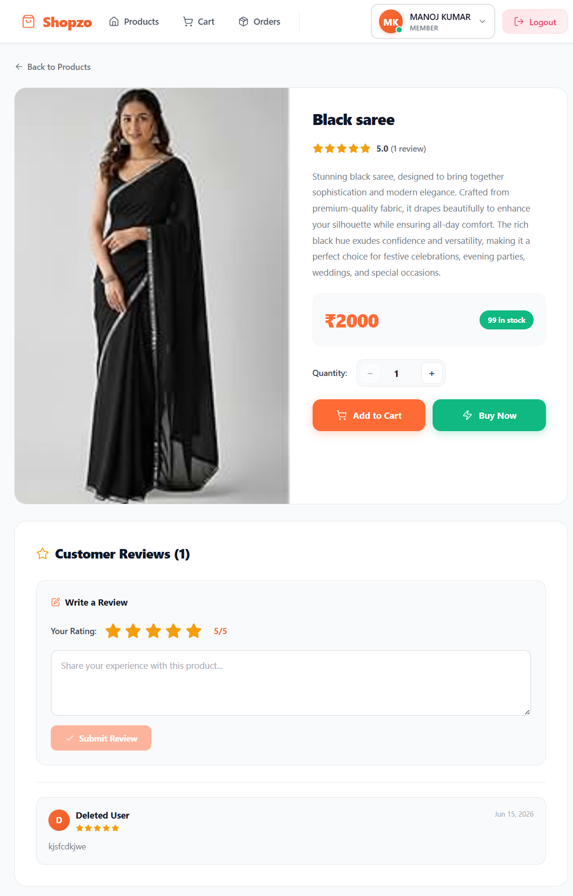
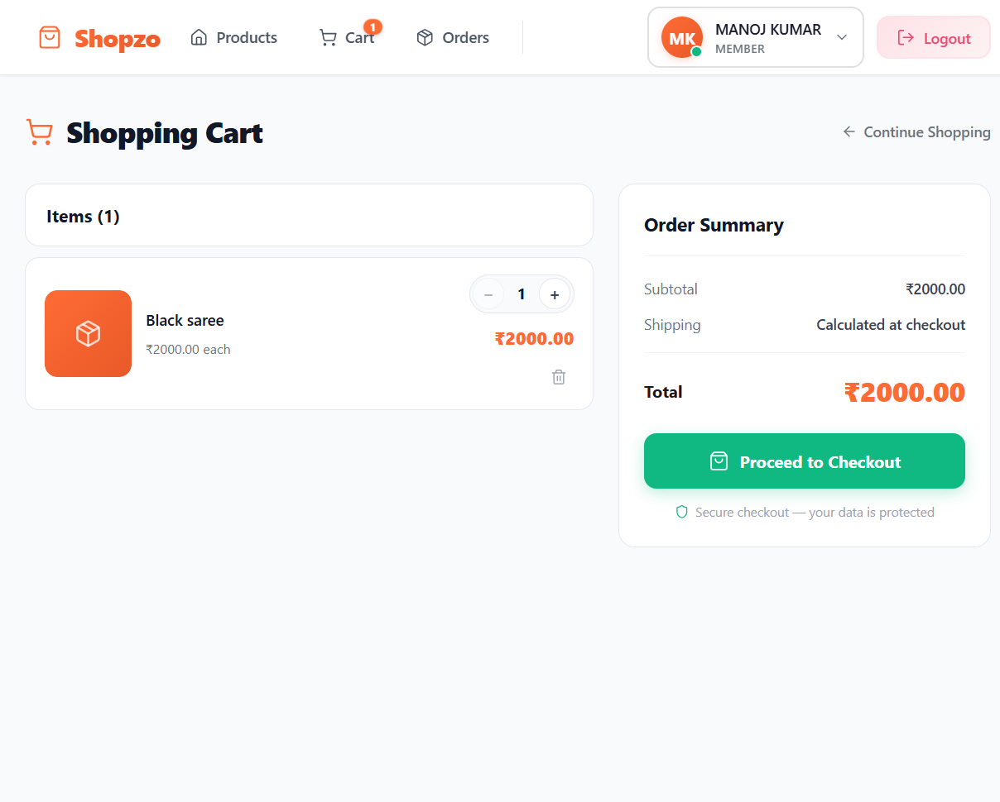
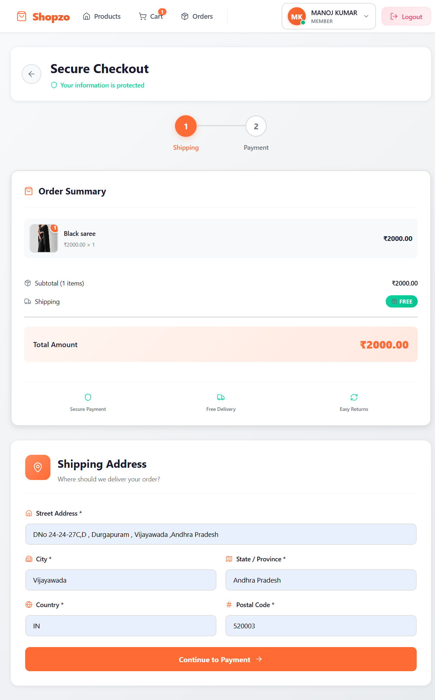
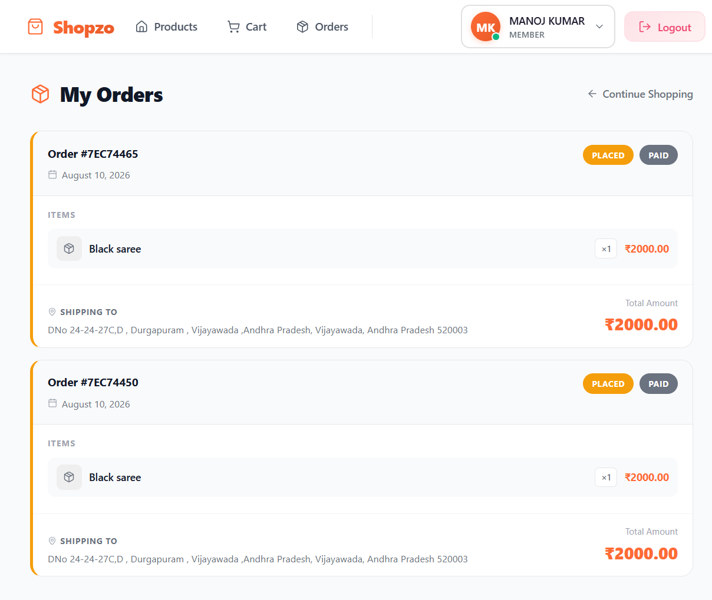
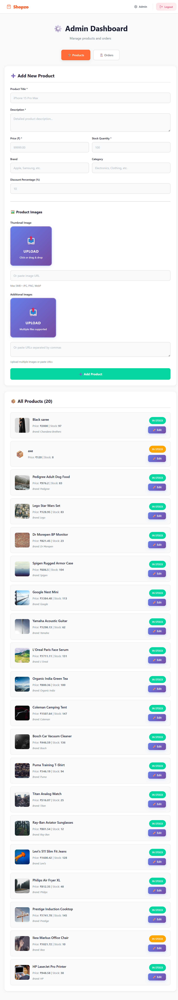
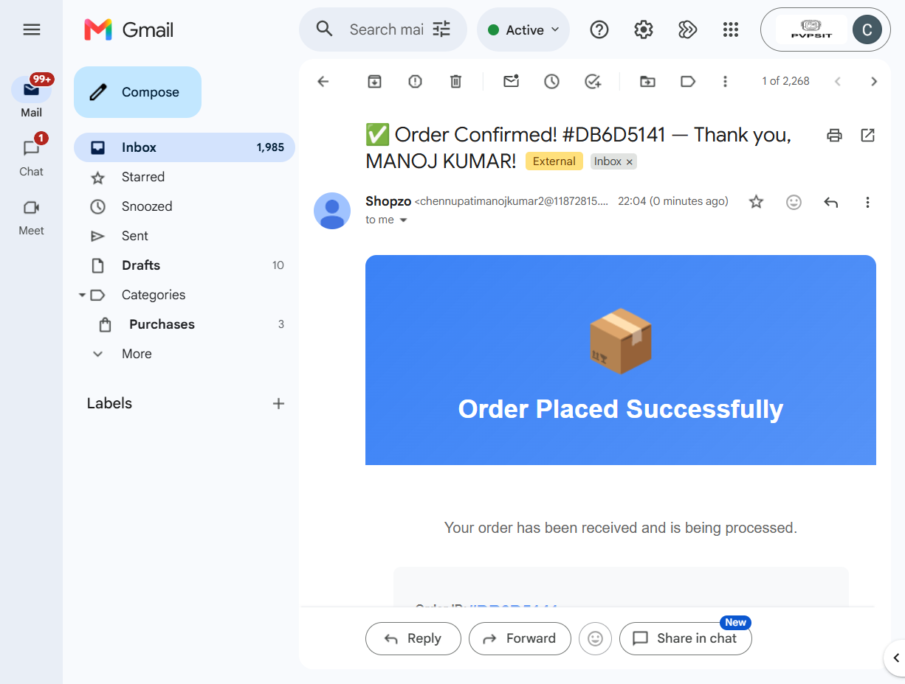

<div align="center">

# 🛒 Shopzo

### A Full-Stack E-Commerce Web Application

[](https://reactjs.org/)
[](https://nodejs.org/)
[](https://www.mongodb.com/)
[](https://www.docker.com/)

**Shopzo** is a production-ready full-stack e-commerce platform featuring a complete shopping workflow, role-based access control, Google OAuth 2.0 authentication, real-time email notifications, and a dedicated admin dashboard — all built with the MERN stack.

[Features](#-features) · [Tech Stack](#-tech-stack) · [Screenshots](#-screenshots) · [Getting Started](#-getting-started) · [API Reference](#-api-reference)

</div>

---

## 📸 Screenshots

### 🏠 Home — Product Catalog
<!-- Take a screenshot of the main products listing page and save as screenshots/products.png -->


### 🔐 Login & Google OAuth
<!-- Take a screenshot of the login page showing the Google Sign-In button and save as screenshots/login.png -->


### 📦 Product Detail & Reviews
<!-- Take a screenshot of a product's detail page with ratings/reviews visible and save as screenshots/product-detail.png -->


### 🛒 Shopping Cart
<!-- Take a screenshot of the cart page with items in it and save as screenshots/cart.png -->


### 💳 Checkout
<!-- Take a screenshot of the checkout page showing address and payment fields and save as screenshots/checkout.png -->


### 📋 Order History & Tracking
<!-- Take a screenshot of the orders list page and save as screenshots/orders.png -->


### 🛠️ Admin Dashboard
<!-- Take a screenshot of the admin dashboard showing product/order management and save as screenshots/admin.png -->


### 📧 Order Confirmation Email
<!-- Take a screenshot of the HTML order status email received in a mailbox and save as screenshots/email.png -->


---

## ✨ Features

### 🔐 Authentication & Security
- **JWT-based** authentication (login, register, protected routes)
- **Google OAuth 2.0** sign-in with `@react-oauth/google`
- **Role-based access control** — `USER` and `ADMIN` roles
- **bcryptjs** password hashing (12 salt rounds)
- Server-side auth & admin middleware for every protected API route

### 🛍️ Shopping Experience
- Browse product catalog with thumbnail, price, discount, brand, and category
- Product detail page with ratings and customer reviews
- **"Buy Now"** direct purchase flow (bypasses cart)
- Full cart workflow — add, update quantity, remove items
- Real-time cart state via **React Context API**

### 💳 Checkout & Orders
- Multi-step checkout with full shipping address form
- Payment methods: **COD** (Cash on Delivery) and **Card/Debit** simulation
- Simulated payment gateway with 95% success rate for card payments
- Automatic stock deduction on order placement
- Order history and detailed order view per user

### 📧 Email Notifications
- **HTML-formatted transactional emails** via Nodemailer (Gmail SMTP)
- Automatic emails triggered on order status changes: `PLACED`, `SHIPPED`, `DELIVERED`, `CANCELLED`
- Branded email templates with order summary, items, and shipping address

### ⭐ Reviews & Ratings
- Authenticated users can post reviews on purchased products
- Star ratings display on product detail page
- Admin can view and moderate all reviews

### 👤 User Profile
- View and edit personal details (name, email, phone)
- Manage delivery addresses
- Change password functionality

### 🛠️ Admin Dashboard
- Manage all products (add, edit, delete, toggle availability)
- View and manage all customer orders
- Update order status (triggers email notification to customer)
- View and moderate user reviews
- Separate, secured admin-only UI routing

---

## 🧰 Tech Stack

| Layer | Technology | Purpose |
|---|---|---|
| **Frontend** | React 18 + Vite | UI framework & build tool |
| **Routing** | React Router DOM v6 | Client-side SPA routing |
| **Styling** | Vanilla CSS | Custom design system, animations |
| **State** | React Context API | Auth, Cart, Toast global state |
| **Icons** | Lucide React | Lightweight SVG icon library |
| **OAuth** | @react-oauth/google | Google Sign-In integration |
| **Backend** | Node.js + Express.js | REST API server |
| **Database** | MongoDB Atlas + Mongoose | Cloud NoSQL database & ODM |
| **Auth** | JSON Web Tokens (JWT) | Stateless authentication |
| **Passwords** | bcryptjs | Secure password hashing |
| **Email** | Nodemailer (Gmail SMTP) | Transactional email delivery |
| **HTTP** | Axios | API communication |
| **Container** | Docker | Containerized deployment |
| **Testing** | Mocha | Backend unit tests |

---

## 🏗️ Project Architecture

```
Shopzo/
│
├── frontend/                        # React + Vite SPA
│   ├── Dockerfile
│   └── src/
│       ├── pages/                   # 11 Route-level page components
│       │   ├── Products.jsx         # Product catalog (home)
│       │   ├── ProductDetail.jsx    # Product page + reviews
│       │   ├── Cart.jsx             # Shopping cart
│       │   ├── Checkout.jsx         # Checkout + payment
│       │   ├── Orders.jsx           # Order history
│       │   ├── OrderDetail.jsx      # Single order view
│       │   ├── Profile.jsx          # User profile
│       │   ├── EditProfile.jsx      # Edit profile & address
│       │   ├── Login.jsx            # Login + Google OAuth
│       │   ├── Register.jsx         # Registration
│       │   └── AdminDashboard.jsx   # Admin control panel
│       │
│       ├── components/              # Reusable UI components
│       │   ├── Navbar.jsx
│       │   ├── ProtectedRoute.jsx
│       │   ├── UserProfileDropdown.jsx
│       │   └── Icon.jsx
│       │
│       ├── context/                 # Global state (React Context)
│       │   ├── AuthContext.jsx
│       │   ├── CartContext.jsx
│       │   └── ToastContext.jsx
│       │
│       └── services/                # Axios API service layer
│
└── backend/                         # Node.js + Express REST API
    ├── Dockerfile
    ├── server.js                    # App entry point
    ├── models/                      # Mongoose data models
    │   ├── userModel.js
    │   ├── ProductModel.js
    │   ├── cartModel.js
    │   ├── OrderModel.js
    │   ├── PaymentModel.js
    │   └── ReviewModel.js
    │
    ├── controllers/                 # Business logic
    │   ├── authController.js
    │   ├── productController.js
    │   ├── cartController.js
    │   ├── orderController.js
    │   ├── reviewController.js
    │   └── adminController.js
    │
    ├── Routes/                      # Express route modules
    │   ├── authRoutes.js
    │   ├── productRoutes.js
    │   ├── cartRoutes.js
    │   ├── orderRoutes.js
    │   ├── reviewRoutes.js
    │   └── adminRoutes.js
    │
    ├── Middlewares/
    │   ├── authMiddleware.js        # JWT verification
    │   └── adminMiddleware.js       # Admin role guard
    │
    └── services/
        └── emailService.js          # Nodemailer + HTML email templates
```

---

## 🚀 Getting Started

### Prerequisites

- [Node.js](https://nodejs.org/) v18 or higher
- [MongoDB Atlas](https://www.mongodb.com/cloud/atlas) account (or local MongoDB)
- A Gmail account for Nodemailer (with an App Password)
- [Google Cloud Console](https://console.cloud.google.com/) project for OAuth 2.0

### 1. Clone the Repository

```bash
git clone https://github.com/your-username/shopzo.git
cd shopzo
```

### 2. Backend Setup

```bash
cd backend
npm install
```

Create a `.env` file in `/backend`:

```env
PORT=8080
NODE_ENV=development

MONGO_URI=your_mongodb_atlas_connection_string

JWT_SECRET=your_super_secret_jwt_key

GOOGLE_CLIENT_ID=your_google_oauth_client_id
GOOGLE_CLIENT_SECRET=your_google_oauth_client_secret

EMAIL_USER=your_gmail_address@gmail.com
EMAIL_PASS=your_gmail_app_password

FRONTEND_URL=http://localhost:5173
```

Start the backend server:

```bash
npm start
# Server runs on http://localhost:8080
```

### 3. Frontend Setup

```bash
cd frontend
npm install
```

Create a `.env` file in `/frontend`:

```env
VITE_API_URL=http://localhost:8080
```

Start the frontend dev server:

```bash
npm run dev
# App runs on http://localhost:5173
```

### 4. Docker Setup (Optional)

```bash
# Build and run backend
cd backend
docker build -t shopzo-backend .
docker run -p 8080:8080 --env-file .env shopzo-backend

# Build and run frontend
cd frontend
docker build -t shopzo-frontend .
docker run -p 5173:80 shopzo-frontend
```

### 5. Create Admin Account

```bash
cd backend
node createAdmin.js
```

---

## 📡 API Reference

### Auth — `/auth`

| Method | Endpoint | Description | Auth Required |
|--------|----------|-------------|:---:|
| `POST` | `/auth/register` | Register new user | ❌ |
| `POST` | `/auth/login` | Login with email & password | ❌ |
| `POST` | `/auth/google` | Google OAuth login/register | ❌ |
| `GET` | `/auth/profile` | Get current user profile | ✅ |
| `PUT` | `/auth/profile` | Update user profile | ✅ |

### Products — `/products`

| Method | Endpoint | Description | Auth Required |
|--------|----------|-------------|:---:|
| `GET` | `/products` | List all active products | ❌ |
| `GET` | `/products/:id` | Get single product details | ❌ |

### Cart — `/cart`

| Method | Endpoint | Description | Auth Required |
|--------|----------|-------------|:---:|
| `GET` | `/cart` | Get user's cart | ✅ |
| `POST` | `/cart/add` | Add item to cart | ✅ |
| `PUT` | `/cart/update` | Update item quantity | ✅ |
| `DELETE` | `/cart/remove/:productId` | Remove item from cart | ✅ |

### Orders — `/orders`

| Method | Endpoint | Description | Auth Required |
|--------|----------|-------------|:---:|
| `POST` | `/orders` | Create new order | ✅ |
| `POST` | `/orders/payment` | Process payment | ✅ |
| `GET` | `/orders` | Get all user orders | ✅ |
| `GET` | `/orders/:id` | Get single order details | ✅ |

### Reviews — `/reviews`

| Method | Endpoint | Description | Auth Required |
|--------|----------|-------------|:---:|
| `POST` | `/reviews` | Post a product review | ✅ |
| `GET` | `/reviews/:productId` | Get reviews for a product | ❌ |

### Admin — `/admin` *(Admin Role Required)*

| Method | Endpoint | Description |
|--------|----------|-------------|
| `GET` | `/admin/products` | Get all products (incl. inactive) |
| `POST` | `/admin/products` | Create new product |
| `PUT` | `/admin/products/:id` | Update product |
| `DELETE` | `/admin/products/:id` | Delete product |
| `GET` | `/admin/orders` | Get all orders |
| `PUT` | `/admin/orders/:id/status` | Update order status (sends email) |
| `GET` | `/admin/reviews` | Get all reviews |

---

## 🗄️ Data Models

```
User        → name, email, password (hashed), phone, address, role, isActive
Product     → title, description, price, discountPercentage, rating, stock,
              brand, category, thumbnail, images[], isActive
Cart        → userId → items[{ productId, quantity, priceAtAddTime }]
Order       → userId, items[], totalAmount, orderStatus, paymentStatus,
              paymentMethod, ShippingAddress
Payment     → orderId, amount, provider, status, transactionId
Review      → userId, productId, rating, comment, userName
```

---

## 📂 Order Status Flow

```
PLACED  →  SHIPPED  →  DELIVERED
   └──────────────────→  CANCELLED
```

> Each status change automatically sends an HTML email notification to the customer.

---

## 🧪 Running Tests

```bash
cd backend
npm test
# Runs Mocha tests in the /tests directory
```

---

## 📃 License

This project is licensed under the **ISC License**.

---

<div align="center">

**Built with ❤️ by Manoj Kumar Chennupati**

[LinkedIn](https://linkedin.com/in/chennupati-manoj-kumar) · [GitHub](https://github.com/ManojChennupati)

</div>
